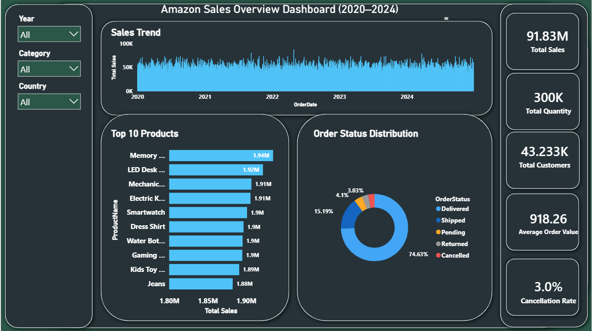
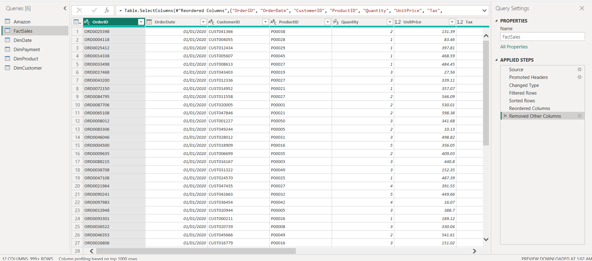
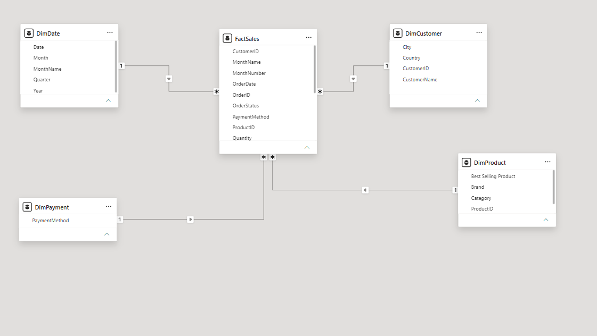
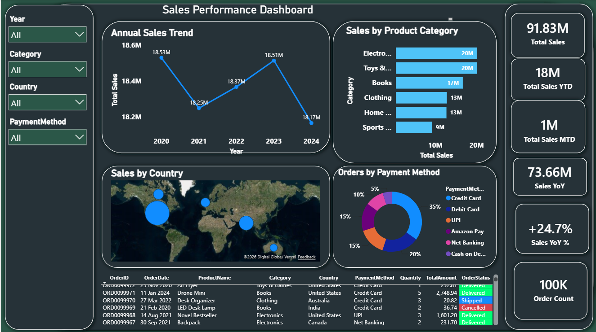
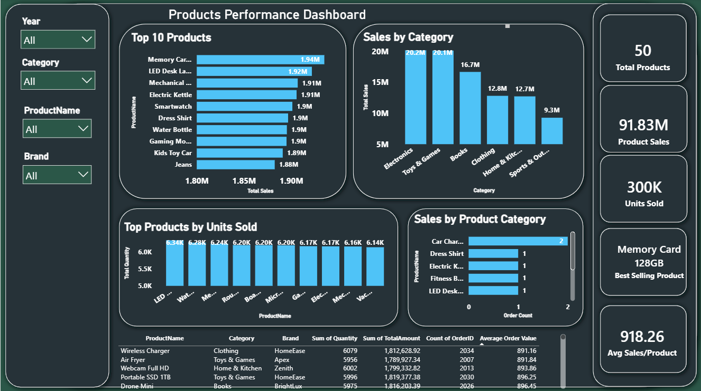
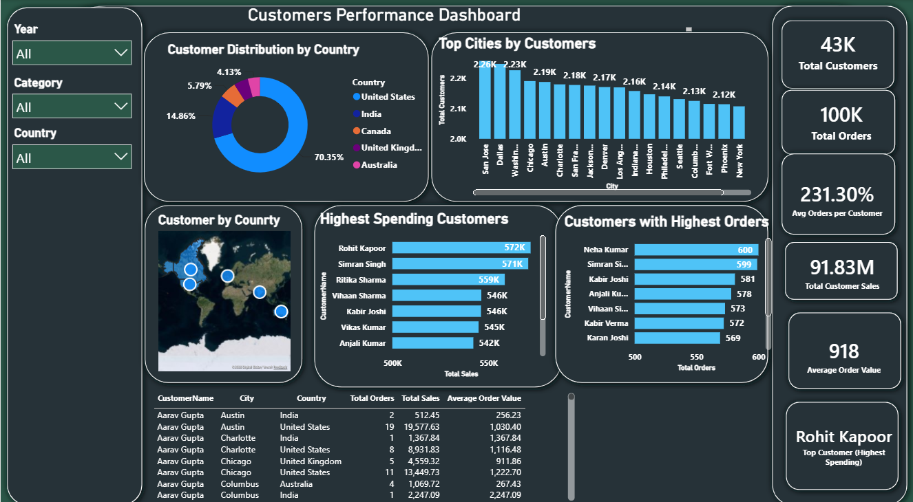
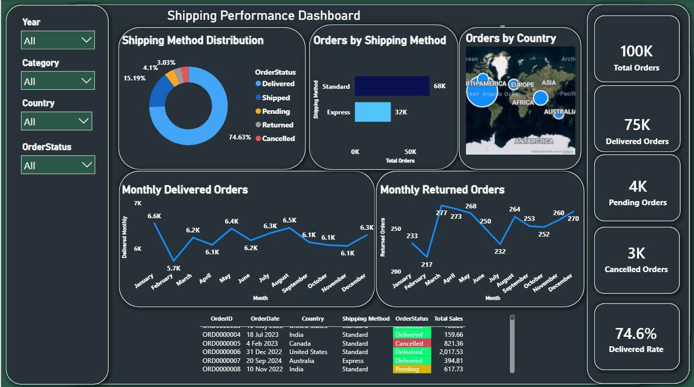

# 📊 Amazon Sales Power BI Dashboard

An end-to-end Business Intelligence project built with **Power BI** to analyze **100,000+ Amazon-style e-commerce sales records**. The project demonstrates the complete analytics workflow, from data preparation to interactive dashboard development for business decision-making.

---

## 🚀 Project Workflow

- 📥 Imported the dataset into Power BI
- 🧹 Cleaned and transformed the data using Power Query
- ⭐ Built a Star Schema data model
- 📐 Developed 10+ DAX measures for KPIs and business analysis
- 📊 Designed interactive dashboards with a consistent dark theme

---

## 📈 Dashboard Pages

- 📌 Overview
- 💰 Sales
- 📦 Products
- 👥 Customers
- 🚚 Shipping

---

## 🛠️ Tools & Technologies

- Microsoft Power BI
- Power Query
- DAX
- Data Modeling (Star Schema)

---

## 📂 Dataset

This project uses a **synthetic Amazon e-commerce sales dataset** containing **over 100,000 records**.

The dataset includes:

- 🛒 Orders
- 👥 Customer Information
- 📦 Products & Categories
- 💳 Payment Methods
- 🚚 Shipping Details
- 🌍 Countries & Cities
- 💰 Sales & Revenue Metrics

The dataset provides a realistic business scenario for data cleaning, modeling, DAX calculations, and interactive dashboard development.

> **Source:** Kaggle (Synthetic Amazon E-commerce Dataset)

---

## 📸 Project Preview

### Overview

### Power Query

### Data Model

### Sales Dashboard

### Products Dashboard

### Customers Dashboard

### Shipping Dashboard

---

## 🎯 Project Highlights

- Analyzed 100,000+ sales records
- Built a Star Schema data model
- Developed 10+ DAX measures
- Designed 5 interactive dashboard pages
- Implemented Time Intelligence (YTD, MTD, YoY)
- Consistent dark theme for improved user experience
  
---

## 👤 Author

**Saud Majrashi**
- LinkedIn:www.linkedin.com/in/saud-majrashi
  
Note: The Power BI (.pbix) file is not publicly available. It can be shared upon request for recruitment or technical evaluation.
